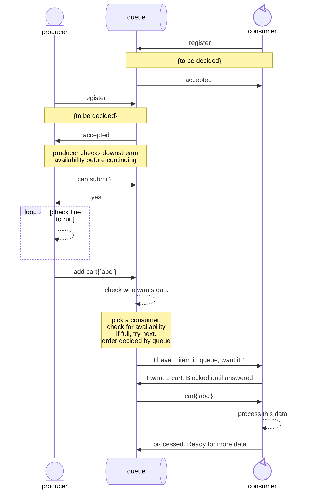

# GoServicer
This is a work in progress, with an initial writing of my idea. 

## background context
I've been working with a strange combination of items recently. One being [Nifi](https://nifi.apache.org/), but I've also been working with more traditional go microservices. I've found that a lot of my nifi work requires writing custom processors, and with that, I can really leverage the builtin functionality of queues, with minimal effort. Maybe it is from the comfort of not needing to write the queueing services as often that is inspiring me to write this, but I believe there are some design decisions I would make differently, especially with the 20+ years of extra wisdom I have to pull from.

## Goals
I'll list a few goals I have, and a bit of reasoning about them.
### Easy configurable queues
This is the main thing that has stuck with me. I want to have an easy way to say `a->b`, and have a stay online if be is restarted. Ideally, I want to be able to do more than that though. I want `->` to be all the queuing logic I need. Do I want `a` to run, or should it be told to halt for back pressure? should `b` run, or should it wait for data? How many items can be buffered in `->`. And if I'm adding all this, I could cover a lot of the interesting items Nifi has, like seeing the path data followed, and things like that.

### Viewable
While nifi is useful, I do not like that it is a graphical programming language, however, I have found these graphics very useful once it is programmed. I think instead I would like to add a display of nodes, and their connections using a graphing library. I've looked and found a few, but I have not set anything in stone.
https://github.com/wcharczuk/go-chart
https://github.com/go-echarts/go-echarts
https://github.com/gonum/gonum

### Less language specific
Nifi has historically only worked with Java, and while new processors in Nifi 2.x can be written using Python, services are all still written in Java, and there will continue to be a language limitation in one form or another. Generally, this is fine, but *my* favorite language didn't make the cut, so here we are.

### More Micro service esc.
I want to create something that more closes resembles modern microservice architecture, and can rely on more existing tooling. While I foresee this being neglected until after a proof of concept, I wish to make something that can run on one **or more** machines at a time. Nifi was written before this was as big of a concept, however, I can rely on an external container orchestration. For a proof of concept however, this will be overlooked.

## Communication structure ideas
I want to have flexibility with my queues, and how they return data. My ideal would be something like this

### diagram notes.
- The main takeaway is the queue handles the logic as best it can for what goes where. Selected consumers are notified with the available file count, and are expected to request the number of files they want at once.
- Once a consumer requests data, it is considered unavailable until the queue is notified otherwise. This way there is minimal time spent waiting on consumers
- Once a consumer has finished working with their data (but not necessarily. The consumers are allowed to preload the next items if they'd like), it tells the queue, and is notified when more data is ready.
- Part of the reason for having the consumer request data, is to allow the consumers to take in batches, and have minimal batch sizes. With this being up to the consumer, services can be written such that one service handles primary flow (min batch size 1), and one handles peak load (min batch size 100). This peak flow will normally never get called, but if the ordinary flow is struggling, it could be.

## Plan Of Action
I want to plan things out to get a realistic proof of concept out, before deciding if this is worth it enough to add more fluff
- [x] Data format basics
    - what will the data look like that gets shared from `a->b`, if its new to `a`, should that have a template? any requirements? Who knows!
    - for the initial process, I'm thinking of calling these carts. It's the data itself, and the basic data you want with it. Google gave some fun potentially associated words for down the line (queue will work for now, but may be too generic). schlep, heave, lug, convey, and conduct could be useful terms down the road.
- [x] Basic Service
    - I think for this design, it will be fine to have everything be a service to start, allowing each item to keep its own running state, as long as it fits a format.
    - deciding if I want a factory method on my services, or if I should leave any and all scaling to external systems. If I wanted to, i could theoretically have each service be generated to match the queue backlog, and killed off if not needed. For further configuration, have a "minimum active", and "maximum active" configuration, that way something like a REST API is only active once per container, but a post processing step can scale up within the container. Then leave further configuration to be outside of each container?
- [x] Service interface
    - this biggest step i see here will be agreeing on the inputs and outputs of any service. Given that this will likely be relatively standard across services, I think it makes sense to create an interface that will represent this. 
    - [x] receive input interface. Basic, handle any live communications needed, accept data, say when more is needed, or when it is not, keep future connections alive.
    - [x] send output interface. Basic, handle the data coming in, and feed it towards the queue output.
- [x] Queue interfaces with channels
    - I want to have the basic functionality of a queue, but I know that one of the early milestones will be swapping that out with a real queue structure. To start, I want channels, but can get the best of both by creating an interface, and using that to represent any form of queue. 
- [ ] first pass revision
    - there are a few things I want to revise and work over.
    - [ ] first demo usage
        - I want to have something simple to see if it is actually worth while at all
    - [ ] first revision
        - once I have a demo, I want to see how I can make things better.
    - [ ] second demo usage
        - Having more than one demo will be useful, and I want to see what will be used where, and how can i remove repeated elements as much as possible
- [ ] naming conventions
    - While first I want concepts written out as clearly as I can, there will be a point where setting up naming conventions will be important. Until this point, nothing is set in stone.
- ### decide where this stands.
    - This is the point where anything after, is purely if this seems to have any grounding. If not, I would like to publish this anyways. There is plenty to learn in failings, same as with success, and I should be less greedy with that knowledge.
    - The main thing here is, I want to have an idea what I'm working towards, and what will satisfy that. We'll see if I change the order as things go on.
- [ ] update docs
    - this is written to get ideas down as quickly as possible, not to stand the test of time, or be useful to any end users. For now it is fine, but I would like to give something more useful to anyone interested.
- [ ] Service isolation
    - For proof of concept, each "service" is really just a go struct running on the same device. I'll likely need to change to using something like gRPC communication interfaces between a service and its queue instead.
- [ ] Queue inspection
    - While channels are useful, or queue structs even, If we want real queuing, we'll need to look at things like persistence of data, and similar problems. 
    - Having something that handles a Kafka connection is likely the easiest option. Who knows, maybe I'll feel like writing a custom option and a kafka option.
- [ ] A Host node.
    - we will likely require a host node to handle configurations, and large scale logistics. Hell, adding or removing services would need it, but so would the graphing. Basically the admin "node" should start having work done.
- [ ] queue updates
    - [ ] time to live
        - having the ability to give a time to live filter on all queues would be helpful. Right now, that's overlooked for complexity sake, but is a very useful feature. Ideally it can be implemented in a way that works with multiple filtering formats (EG, time in queue, total lifetime, filter out empty items, and options like that)
    - [ ] queue ordering
        - right now, the only queue order i have is first in first out, but I'd like to have more. Not just as custom queues, but as selectable types. Most of the code is kept the same, but if we have a configurable less than function, we can order items however we like
    - [ ] queue balancing
        - so, right now the example channel queue only outputs to the first possible recipient, but I'd like to have more options selectable. All queues should be able to 